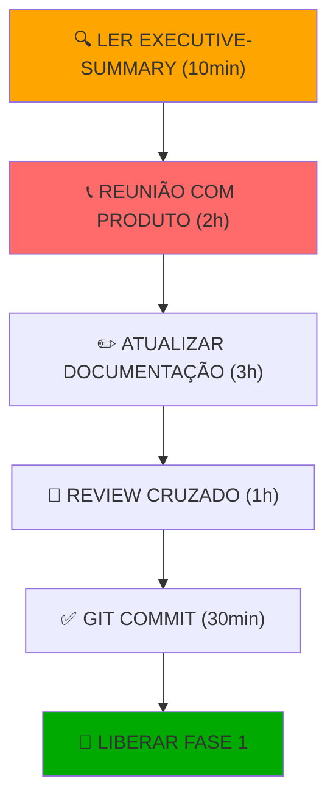

# 📊 DASHBOARD DE REVISÃO - Status das Inconsistências

**Data da Revisão:** Abril 13, 2026  
**Documentos Revisados:** 7 principais + 4 novos  
**Total de Inconsistências:** 24

---

## 🎯 STATUS GERAL

```
CRÍTICAS        🔴 5   ████████████████████░░░░░░░░░░░░░░░░░░░░░░░░░░░░░░ BLOQUEADOR
IMPORTANTES     🟠 8   ████████████████░░░░░░░░░░░░░░░░░░░░░░░░░░░░░░░░░░ DEVE RESOLVER
DE ATENÇÃO      🟡 7   ██████████░░░░░░░░░░░░░░░░░░░░░░░░░░░░░░░░░░░░░░░░ PODE IMPACTAR
MENORES         🟢 4   ██████░░░░░░░░░░░░░░░░░░░░░░░░░░░░░░░░░░░░░░░░░░░░░ COMPLEMENTAR
─────────────────────────────────────────────────────────────────────────
TOTAL           24  100% DE COBERTURA DOCUMENTADA

AÇÃO NECESSÁRIA:  🚨 NÃO INICIAR SEM RESOLVER OS 5 CRÍTICOS
TEMPO ESTIMADO:  2-3 dias (8-15 horas de trabalho)
IMPACTO:         Schema do BD precisa ser alterado
```

---

## 🔴 CRÍTICOS (5) - BLOQUEADORES IMEDIATOS

| #   | Problema                              | Arquivo            | Risco      | Resolução                                      |
| --- | ------------------------------------- | ------------------ | ---------- | ---------------------------------------------- |
| 1️⃣  | **Tabela Users não existe**           | database-design.md | 🔴 CRÍTICO | Criar schema User (email, password, role)      |
| 2️⃣  | **Múltiplos contatos sem mapeamento** | database-design.md | 🔴 CRÍTICO | Opção: tabela ContactPerson ou 1 contato (MVP) |
| 3️⃣  | **Reserva de embalagens indefinida**  | database-design.md | 🔴 CRÍTICO | Adicionar reservedStock em Packaging           |
| 4️⃣  | **IE obrigatório B2B sem validação**  | database-design.md | 🔴 CRÍTICO | Adicionar CHECK constraint OR validação        |
| 5️⃣  | **Máximo 3 itens sem enforcement**    | api-design.md      | 🔴 CRÍTICO | Validação em POST /orders                      |

**Status:** ❌ BLOQUEADO  
**Gate:** Autorização de Product Manager + Tech Lead  
**Timeline:** HOJE (4-6h)

---

## 🟠 IMPORTANTES (8) - DEVEM ESCLARECER

| #    | Questão                           | D. Origem          | Status |
| ---- | --------------------------------- | ------------------ | ------ |
| 6️⃣   | Separação do site está explícita? | business-rules.md  | ❓     |
| 7️⃣   | Estoque bloqueia pedido?          | business-rules.md  | ❓     |
| 8️⃣   | "Item" = linha OU unidade?        | business-rules.md  | ❓     |
| 9️⃣   | Roles completos - quem acessa?    | api-design.md      | ❓     |
| 🔟   | Múltiplos contatos B2B?           | business-rules.md  | ❓     |
| 1️⃣1️⃣ | Soft delete vs hard delete?       | database-design.md | ❓     |
| 1️⃣2️⃣ | OrderNumber sequência?            | database-design.md | ❓     |
| 1️⃣3️⃣ | Campos produção faltando          | database-design.md | ❓     |

**Status:** ⚠️ AGUARDANDO CLARIFICAÇÃO  
**Com Quem:** Product Manager, Cliente  
**Timeline:** 2-3h (reunião)

---

## 🟡 DE ATENÇÃO (7) - PODEM IMPACTAR

| #    | Tema                       | Solução                          | Prioridade |
| ---- | -------------------------- | -------------------------------- | ---------- |
| 14️⃣  | Histórico de preços        | MVP sem versionamento, v2 com    | Média      |
| 1️⃣5️⃣ | Rate limiting sem detalhes | Use express-rate-limit           | Média      |
| 1️⃣6️⃣ | Timezone indefinido        | UTC no DB, conversão FE          | Baixa      |
| 1️⃣7️⃣ | Email pessoa contato       | Adicionar campo STRING           | Baixa      |
| 1️⃣8️⃣ | Cancelamento sem workflow  | Versão 1 básica, notificações v2 | Média      |
| 1️⃣9️⃣ | Paginação sem limite       | Math.min(limit, 100)             | Baixa      |
| 2️⃣0️⃣ | Validação CPF              | lib cpf-cnpj-validator           | Baixa      |

**Status:** ✅ DOCUMENTADAS, podem esperar Phase 1

---

## 🟢 MENORES (4) - COMPLEMENTARES

| #    | Assunto                        | Tipo          | Esforço |
| ---- | ------------------------------ | ------------- | ------- |
| 2️⃣1️⃣ | Campos computados (totalValue) | Implementação | Trivial |
| 2️⃣2️⃣ | Índices em todas tabelas       | Review        | Trivial |
| 2️⃣3️⃣ | Datas vagas em docs            | Limpeza       | Trivial |
| 2️⃣4️⃣ | Performance em views SQL       | Consideração  | Trivial |

**Status:** ✅ CONHECIDAS

---

## 📈 DOCUMENTOS IMPACTADOS

```
database-design.md    🔴🔴🔴 3 seções principais alteradas
business-rules.md     🔴🟠🟠 2 seções novas + clarificações
api-design.md         🔴🟠 1 validação crítica adicionada
system-architecture.md 🟡  2 middlewares novos
development-roadmap.md 🟠  Semana 0 necessária
project-overview.md   ✅  Sem alterações recomendadas
ui-guidelines.md      ✅  Sem alterações recomendadas
```

---

## 🗂️ ARQUIVOS DE REVISÃO CRIADOS

**Para facilitar resolução:**

1. **REVIEW-INCONSISTENCIES.md** (8 KB)
   - Análise detalhada de cada uma das 24 inconsistências
   - Matriz de resolução
   - Responsáveis e dependências
   - ⏱️ 20-30 min de leitura

2. **REVIEW-EXECUTIVE-SUMMARY.md** (3 KB) ⭐ COMECE POR AQUI
   - Resumo visual de 1 página
   - 5 críticos destacados
   - Distribuição de esforço
   - ⏱️ 5-10 min de leitura

3. **ACTION-PLAN.md** (7 KB)
   - Tarefas específicas por responsável
   - Estimativas de tempo
   - Patches recomendados a cada arquivo
   - ⏱️ 15-20 min de leitura

4. **PRE-IMPLEMENTATION-CHECKLIST.md** (6 KB)
   - Checklist para marcar conforme resolve
   - Assináveis de aprovação
   - Gate final de liberação
   - ⏱️ Para acompanhamento

---

## 🎬 WORKFLOW RECOMENDADO



---

## 📅 TIMELINE RECOMENDADO

### Hoje (04/13):

```
08:00 ─ Ler REVIEW-EXECUTIVE-SUMMARY (10 min)
08:15 ─ Ler REVIEW-INCONSISTENCIES (se quiser detalhe) (20 min)
08:45 ─ Reunião com Product Manager (2h)
10:45 ─ Pausa
11:00 ─ Atualizar documentação (3h)
14:00 ─ Almoço
```

### Amanhã (04/14):

```
08:00 ─ Review cruzado (1h)
09:00 ─ Ajustes finais (1h)
10:00 ─ Git commit & push (30 min)
10:30 ─ ✅ PRONTO PARA FASE 1
```

---

## 💡 INSIGHTS IMPORTANTES

### O que está CERTO ✅

- ✅ Arquitetura geral bem pensada (3-layer)
- ✅ Stack tecnológico claro e moderno
- ✅ API design segue convenções REST
- ✅ UI guidelines bem detalhado e consistent
- ✅ Roadmap realista (16 semanas)
- ✅ Regras de negócio documentadas

### O que está ERRADO ❌

- ❌ Schema do BD incompleto (faltam Users, etc)
- ❌ Relacionamentos ambígoos (contatos B2B)
- ❌ Validações não mapeadas (IE, max items)
- ❌ Fluxos críticos indefinidos (embalagens)
- ❌ Decisões sem owner claro

### O que pode MELHORAR 🔄

- 🔄 Reforçar no texto a independência total do site institucional
- 🔄 Histórico de preços → versioning strategy
- 🔄 Roles completos → matriz RBAC
- 🔄 Cancelamento → workflow com notificações

---

## 🎯 META

```
┌─────────────────────────────────────────────┐
│  DOCUMENTAÇÃO PRONTA EM 02 DIAS             │
│  Para iniciar FASE 1 com confiança          │
│  ✅ 0 dúvidas                               │
│  ✅ 100% alinhado                           │
│  ✅ Schema do BD finalizado                 │
│  ✅ Todos os críticos resolvidos            │
└─────────────────────────────────────────────┘
```

---

## 📞 PRÓXIMO PASSO

**👉 AÇÃO IMEDIATA:**

1. Product Manager: Ler `REVIEW-EXECUTIVE-SUMMARY.md`
2. Tech Lead: Ler `ACTION-PLAN.md`
3. Agendar reunião de clarificação (2h) → HOJE A TARDE ou SEGUNDA DE MANHÃ

**Sem reunião, não há liberação para iniciar implementação.**

---

**Dashboard Atualizado:** 13/04/2026 - 16:00  
**Próxima Atualização:** Após reunião de clarificação  
**Responsável:** Tech Lead
